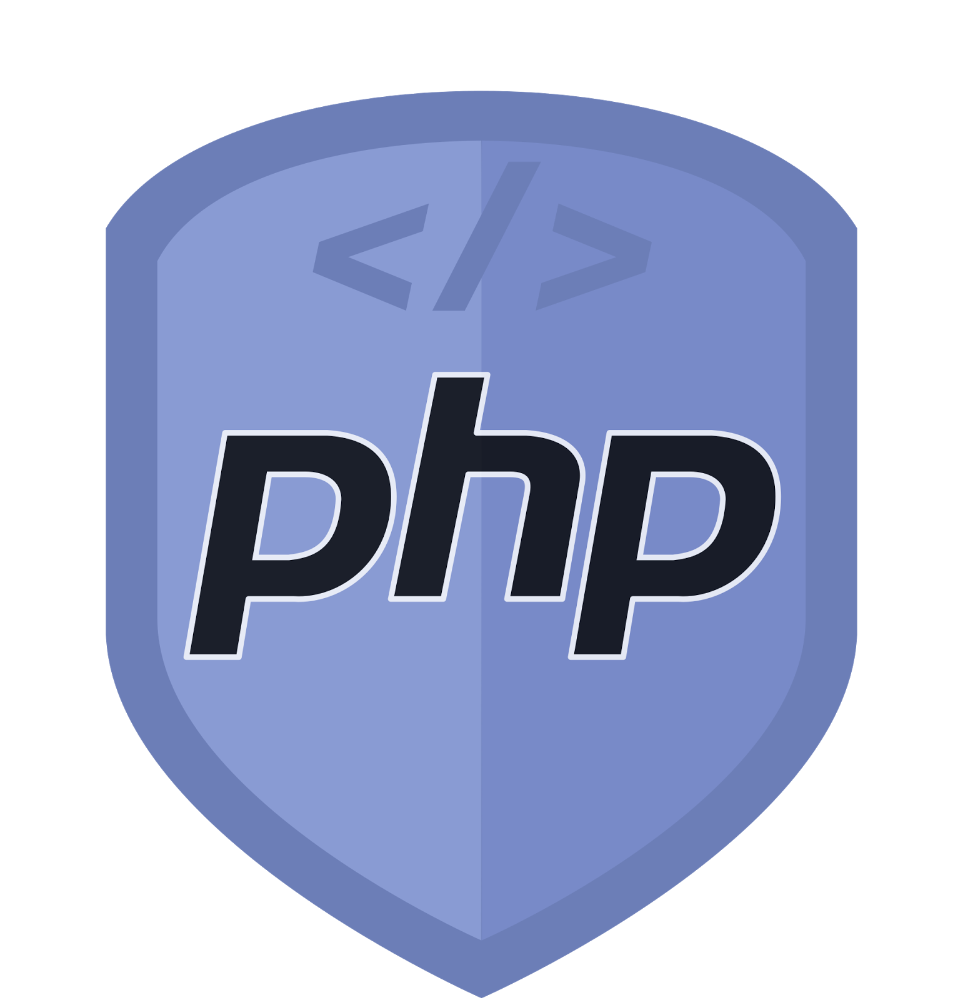

### Saludos! 👋Soy Luna

<!--
**LunaGR/LunaGR** is a ✨ _special_ ✨ repository because its `README.md` (this file) appears on your GitHub profile.
-->

<b>Desarrolladora web.</b>

<h2> Sobre mi </h2>

  Soy una entusiasta del frontent, sobre todo lo relacionado al diseño de páginas web e interfaces, pero no es en lo único que me especializo.
  El manejo de BBDD y de programar con java son otros de mis lenguajes predilectos.

  Mi objetivo es aprender tanto como para ser fullstack y llegar a hacer proyectos y conseguir superar cualquier reto.
  

  

<h2>Logros</h2>

  Conseguí migrar los datos al access para facilitar las búsquedas de clientes a mis compañeros y tener de esta manera copias de los documentos necesarios.
  
  También conseguí encontrar la forma de evitar los duplicados en el crm de SAGE de clientes.
  
  La gran mayoria de logros se centran sobre todo en pequeños arreglos en las bbdd para facilitar el trabajo y con las conexiones tanto de red 
  como de errores y problemas básicos en los software.

  

<h2> Skills </h2>

<!-- Aqui va los iconos -->

 

